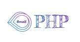

# small-php
   
A PHP micro framework to build APIs. This is for learning purpose only is not mean to be used in production.

## Router

### Supported https methods
 1) GET
 2) POST
 3) PUT 
 4) DELETE
 
### Parameters
- '/'   Base route
- '{a}' Anything
- '{n}' Only numbers
- '{w}' Only Letters 
- '{b}' Numbers and letters

Examples

```php
include "server/core/Router.php";
include "server/core/Database.php";

$app = new Router(); 
$app->db = new Database();

$app->get('/api', function($params) {	
   return 'Test Api';	
});

// Getting parameters
$app->get('/api/products/{n}/{w}', function($params) {
   
   return $this->json([
   	'path' => $params[0],
   	'numbers' => $params[1],
	'letters' => $params[2],
   ]);
   
});

```

## View
The template class replaces the tags that are written like this {:tag_name} in the HTML.

### Template 
Path: server/templates/post.html 

```html
<!DOCTYPE html>
<html>
<head>
	<title>{:title}</title>
</head>
<body>
	<span>{:title}</span>
</body>
</html>

```

### index.php

```php
include "server/core/View.php";
include "server/core/Router.php";

$app = new Router(); 
$app->view = new View();

//Setting the template path
$app->view->setPath("server/templates");

$app->get('/api/template', function($params) {	

   $this->view->render("/posts.html", [
   	'title' => 'Amazing title'
   ]);
   
});
```

## Database
Database config file is located in the following path: server/config/database.php

```php
include "server/core/View.php";
include "server/core/Router.php";
include "server/core/Database.php";

$app = new Router(); 
$app->view = new View();
$app->db = new Database();

$app->view->setPath("server/templates");

$app->get('/api/products', function($params) {

	$this->db->connect();
	
	$query = 'SELECT * FROM products';

	$stmt = $this->db->conn->prepare($query);
	$stmt->execute();

	$result = $stmt->fetchAll();

	return $this->json($result);
});
```
